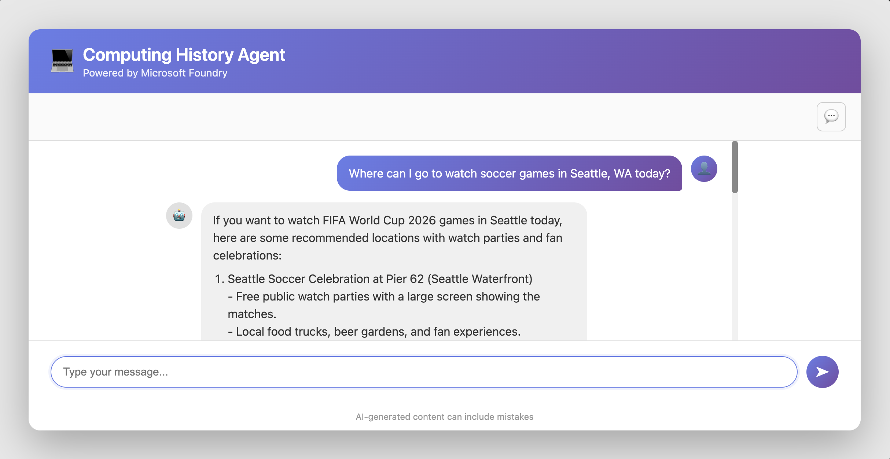
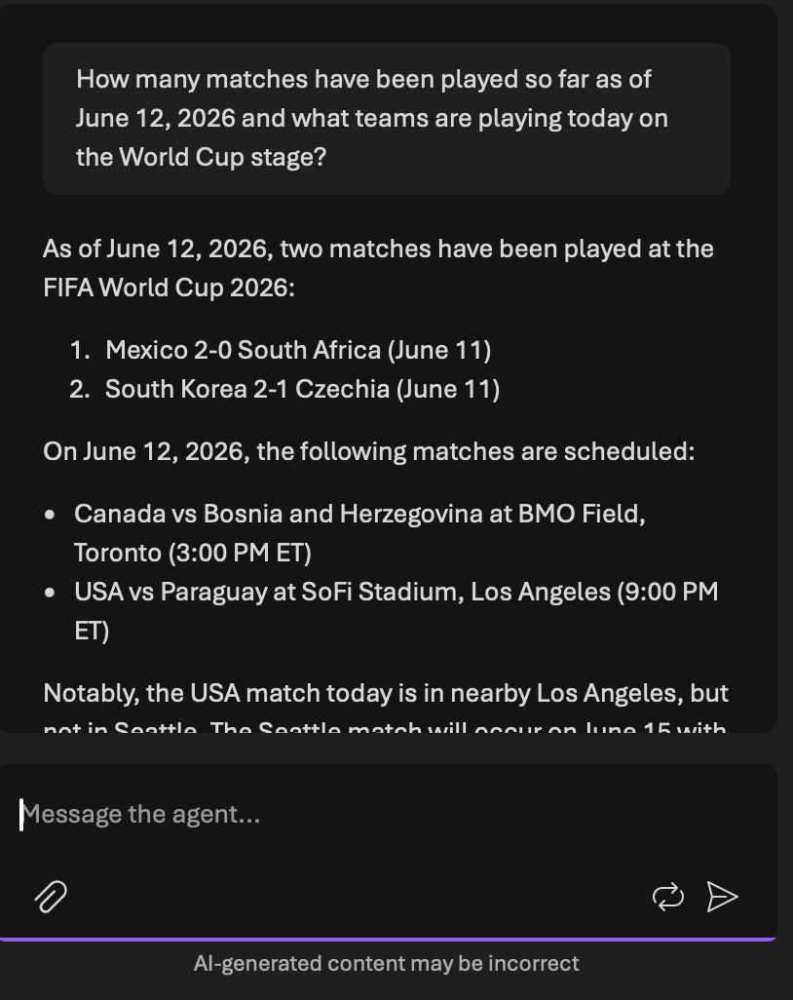
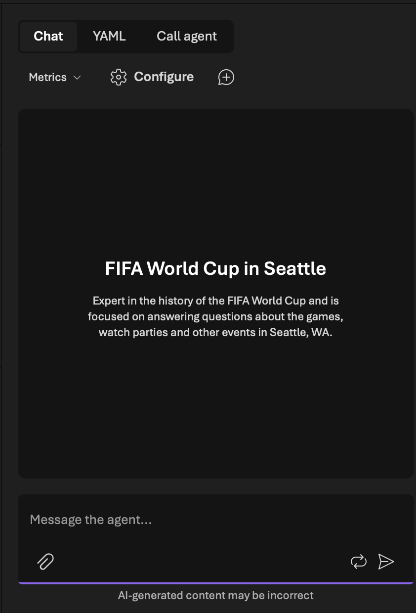

# World Cup Seattle 2026 — AI Concierge Agent

A conversational AI web app that helps fans navigate the **FIFA World Cup 2026** in Seattle, WA. Ask about matches at Lumen Field, watch parties around the city, FanFest events, transit tips, and the history of the tournament — all powered by a custom AI agent built on Microsoft Azure AI Foundry.



## Why I Built This

The FIFA World Cup 2026 is being co-hosted across North America, with **Seattle hosting six matches at Lumen Field in June and July 2026**. With hundreds of thousands of visiting fans, I wanted to build a focused AI assistant that could answer questions about the tournament locally — match schedules, watch parties, FanFest events, and Seattle-specific info — without going off-topic.

This project demonstrates how a tightly-scoped AI agent + a web search tool can outperform a general-purpose chatbot for niche, time-sensitive use cases.

## Purpose

Users chat with an AI concierge through a clean web interface. The agent:

-  Answers questions about World Cup matches in Seattle (schedule, teams, venue info)
-  Recommends **watch parties, bars, and FanFest events** around the city
-  Helps with **transit, parking, and getting to Lumen Field**
-  Discusses tournament history and notable players
-  Uses an integrated **web search tool** for real-time info (event updates, news)
-  Maintains **multi-turn conversation history** so follow-ups retain context
-  Politely declines off-topic questions thanks to a constrained system prompt

## Architecture

```
┌──────────────┐    HTTP    ┌──────────────┐   Responses API   ┌──────────────────────┐
│   Browser    │ ─────────▶ │  Flask App   │ ────────────────▶ │  Azure AI Foundry    │
│  (chat UI)   │ ◀───────── │   (Python)   │ ◀──────────────── │   Agent Endpoint     │
└──────────────┘            └──────┬───────┘                   └──────────┬───────────┘
                                   │                                      │
                                   │ DefaultAzureCredential               ▼
                                   │ (Entra ID bearer token)     ┌──────────────────┐
                                   └────────────────────────────▶│   gpt-4.1-mini   │
                                                                 │   + Web Search   │
                                                                 └──────────────────┘
```

## Tech Stack

| Layer | Technology |
|---|---|
| **Language** | Python 3.11+ |
| **Web framework** | Flask |
| **AI platform** | Microsoft Azure AI Foundry |
| **Model** | gpt-4.1-mini |
| **API** | OpenAI Responses API |
| **Auth** | Azure Identity SDK — `DefaultAzureCredential` + bearer token provider (keyless via Entra ID) |
| **Frontend** | HTML / CSS / JS templates with `markdown` + `bleach` for safe rendering |
| **Tooling** | VS Code, Foundry Toolkit extension, GitHub Copilot, Azure CLI |

## Features

-  Domain-specialized agent with a custom system prompt
-  Web search tool for real-time event info
-  Multi-turn conversation with bounded history (last 3 exchanges)
-  **Keyless authentication** via Microsoft Entra ID — no API keys in code
-  Safe markdown rendering with HTML sanitization (bleach)
-  Environment-based configuration via `.env` files
-  Input validation (message length limits) and safe external link handling

##  Agent System Prompt

```
You are an expert in the history of the FIFA World Cup and are focused on
answering any questions about the FIFA World Cup in Seattle, WA while it
is here for June and July 2026. You only answer questions about significant
players and events in the Seattle area, and about notable events and watch
parties pertaining to the FIFA World Cup 2026. Do not engage in conversations
on any topic that is unrelated to FIFA World Cup.
```

The web search tool is enabled so the agent can pull current event listings, schedule changes, and news.

##  Setup

### Prerequisites

- Python 3.11+
- An Azure subscription with an AI Foundry project and a published agent
- Azure CLI installed (`az`)

### Steps

1. **Clone the repo:**
   ```bash
   git clone https://github.com/iiSurf/aiAgenticHelper.git
   cd aiAgenticHelper
   ```

2. **Create and activate a virtual environment:**
   ```bash
   python -m venv .venv
   source .venv/bin/activate     # macOS / Linux
   .venv\Scripts\activate        # Windows
   ```

3. **Install dependencies:**
   ```bash
   pip install -r requirements.txt
   ```

4. **Configure environment:**
   ```bash
   cp .env.example .env
   ```
   Edit `.env` and set `AGENT_ENDPOINT` to your Foundry agent's Responses API endpoint.

5. **Sign in to Azure:**
   ```bash
   az login
   ```

6. **Run the app:**
   ```bash
   python app.py
   ```
   Visit [http://localhost:5000](http://localhost:5000) and start chatting.

##  Screenshots

### Foundry Agent Playground


### Flask Web App in Action


##  What I Learned

- **Agentic AI design** — encapsulating a model, system prompt, and tools into a reusable, versioned agent rather than relying on stateless API calls
- **Modern Azure auth** — using `DefaultAzureCredential` and bearer token providers instead of static API keys, the recommended pattern for production Azure workloads
- **Prompt engineering for scope control** — keeping the LLM focused on a single domain using the system prompt
- **Conversation state management** — passing trimmed conversation history to the model each turn to preserve context without unbounded token growth
- **Secrets hygiene** — `.env`, `.env.example`, `.gitignore` discipline, and `DefaultAzureCredential` keyless auth
- **Tool-augmented LLMs** — extending an agent's knowledge beyond its training cutoff with web search

##  Project Structure

```
.
├── app.py                  # Flask app entry point + routes
├── agent_client.py         # Wraps the OpenAI Responses API + auth
├── requirements.txt        # Python dependencies
├── .env.example            # Template for environment config
├── .gitignore
├── templates/              # Flask HTML templates
├── static/                 # CSS / JS assets
└── docs/
    └── screenshots/        # README images
```

##  Project Status

This project began as an exercise based on a Microsoft Learn tutorial on Azure AI Foundry, then I rebuilt it around a domain I actually cared about: helping fans navigate the World Cup in my city. Azure resources have been deprovisioned to avoid charges, but the code is fully functional with any valid Foundry agent endpoint.

## License

MIT

---

Built by **Microsoft Learn and Nick Sandberg** · [LinkedIn](https://linkedin.com/in/nick-hsd)
